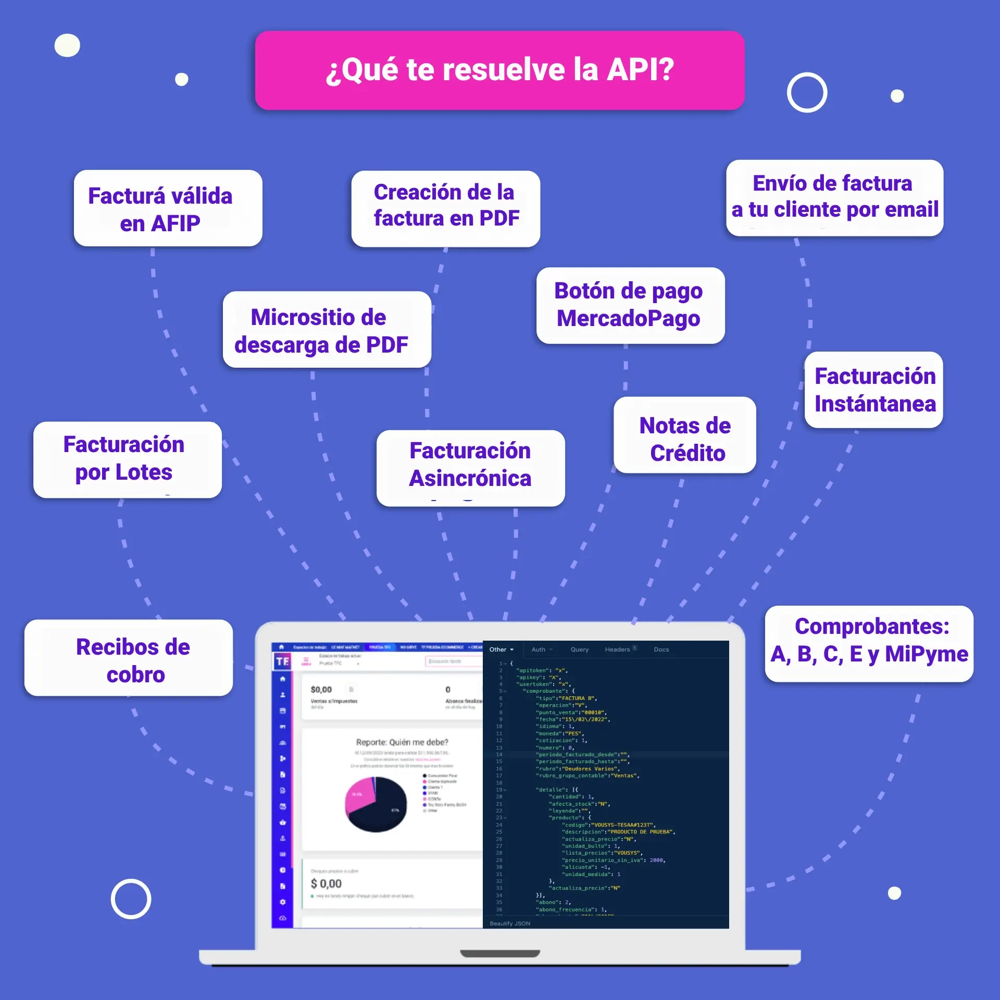

# Facturación instantánea por Lotes

TusFacturasAPP es un proveedor SaaS líder de servicios de facturación electrónica en Argentina, que permite a empresas de todos los tamaños emitir comprobantes fiscales válidos de manera rápida, segura y cumpliendo con todas las regulaciones de la AFIP.

### ¿Qué podes hacer con la API para facturación AFIP?

Integra fácilmente la facturación electrónica en tu software con la API de TusFacturasAPP. Emite comprobantes fiscales válidos desde tu sistema y obtén respuestas inmediatas de la AFIP.

<figure><figcaption></figcaption></figure>

### ¿Cómo empiezo?

Te sugerimos revisar la guia de [¿Cómo empiezo?](../como-empiezo.md) . Una vez configurada tu cuenta y creado tu CUIT+Punto de venta (PDV) en [TusFacturasAPP](https://www.tusfacturas.app), podrás comenzar a emitir facturas electrónicas AFIP Argentina válidas.&#x20;

Comenza ya a cumplir con las regulaciones fiscales y brinda una experiencia de facturación digital eficiente a tus clientes. [Solicita acceso](https://www.tusfacturas.app/quiero-probar-api-factura-electronica.html) a nuestra API de facturación electrónica.

### ¿Qué puedo facturar por lote?

Podes enviar a facturar comprobantes de tipo A,B,C y M; ya sean facturas, notas de crédito, notas de débito y hasta facturas-recibos. **No podrás enviar comprobantes de tipo E ni de Factura de crédito electrónica (FEC) en ésta modalidad.**

&#x20;¿No sabes qué [tipo de comprobante debes emitir](../que-tipos-de-comprobante-debo-puedo-emitir.md)? Consultalo [desde aquí](../que-tipos-de-comprobante-debo-puedo-emitir.md)

Tenés alguna duda del servicio? checkea las [API FAQs](../faqs-or-preguntas-frecuentes.md), y si no encontrás lo que buscabas, contactanos por los canales de atención que tenemos disponibles en la plataforma web [www.tusfacturas.app](https://www.tusfacturas.app)

### **Facturación instantánea por Lote**

Al utilizar éste servicio, los comprobantes que emitas impactarán de inmediato en nuestra plataforma y obtendrás la respuesta al instante, ya que utiliza el servicio de facturación por lotes de AFIP (siempre y cuando los servicios de dicho organismo se encuentren funcionando).


Es importante que controles los errores, dado que los servicios de AFIP se caen muy seguido y según funcionen sus servicios, la generación de un comprobante puede llegar a demorar hasta 1,30 minutos 😰. Para evitar éste tipo de problemas, te sugerimos utilizar la [facturación por lotes asincrónica (encolada)](facturacion-asincronica-por-lotes-encolada.md)


Es necesario leer primero, la documentación de "[Facturación](./)", para conocer cómo debe componerse cada request que envíes.

### ¿Cómo generar una venta por lotes instantáneos?

Consulta nuestra guía detallada "[API Facturación AFIP](./)" para conocer a profundidad el servicio, los requerimientos de cada solicitud y los datos específicos que debes enviar para generar nuevos comprobantes de venta. Nuestra documentación completa y ejemplos de código te facilitarán una integración rápida y eficiente de la facturación electrónica en tu sistema actual.


<mark style="color:green;">`POST`</mark> `https://www.tusfacturas.app/app/api/v2/facturacion/`<mark style="color:purple;">`lotes`</mark>


Charset: UTF-8

Formato esperado: JSON

#### Request Body

| Name      | Type   | Description                                         |
| --------- | ------ | --------------------------------------------------- |
| requests  | array  | Según estructura de de cada item (detallado abajo). |
| usertoken | string | Tus credenciales de acceso                          |
| apitoken  | string | Tus credenciales de acceso                          |
| apikey    | string | Tus credenciales de acceso                          |

#### Estructura del bloque: "requests"

"requests debe ser un array, que contiene cada uno de los comprobantes a emitir, según se define en la documentación de "[Facturación](./)".


**Datos a tener en cuenta**

* **La cantidad máxima de requests (por lote) debe ser de 20**, pero debes tener en cuenta que por cuestiones de seguridad, nuestra plataforma funciona limitando su tiempo de procesamiento y según funcionen los servicios de AFIP, puedes obtener una respuesta de timeout (524). En caso de recibir un 524, ten en cuenta que los comprobantes que enviaste, seguirán siendo procesados en background, pero no recibirás la respuesta.  Te sugerimos utilizar la modalidad de [Facturación encolada por lotes](facturacion-asincronica-por-lotes-encolada.md) para evitar éste tipo de errores.
* Todos los requests de ésta llamada, deben ser del **mismo tipo de comprobante**. Ej: todos deben ser FACTURA A
* Los request deben venir **ordenados por número ascendente**, de la misma manera que si los enviarás a procesar uno por uno.
* **No podrás enviar comprobantes de** [**tipo E**](api-factura-electronica-afip-factura-electronica-afip-exportacion.md) **ni de** [**Factura de crédito electrónica (FEC)**](api-factura-electronica-afip-factura-de-credito-electronica-mipyme-fce.md) **en ésta modalidad.**
* Si se detecta al menos un (1) error de validación de datos de nuestro lado, el lote no se mandará a procesar.


La estructura de cada "{objeto\_comprobante}" debe ser acorde a los siguientes tipos de comprobante a generar:&#x20;

[comprobantes de tipo A](api-factura-electronica-afip-factura-a-nota-de-debito-a-nota-de-credito-a.md)

&#x20;[comprobantes de tipo B](api-factura-electronica-afip-factura-nota-de-debito-b-nota-de-credito-bb.md)

[comprobantes de tipo C](api-factura-electronica-afip-factura-c-nota-de-debito-c-nota-de-credito-c.md)[ ](api-factura-electronica-afip-factura-electronica-afip-exportacion.md)

&#x20;[Comprobantes de tipo Factura de crédito electrónica MiPyme](api-factura-electronica-afip-factura-de-credito-electronica-mipyme-fce.md)

Revisa nuestra guía  "[API Facturación AFIP](./)" para conocer a fondo el servicio y los requerimientos de cada solicitud.

#### Ejemplo de JSON a enviar


```json
{
	"apitoken": "xxxx",
	"apikey": "xxxx",
	"usertoken": "xxxxx",
	"requests": [
			{objeto_comprobante}, 
			{objeto_comprobante}, 
			{objeto_comprobante}
		    ]
}
```


#### Ejemplo de como invocarlo desde PHP


```php
// ENVIO REQUEST
$url ="https://www.tusfacturas.app/api/v2/facturacion/lotes" ;

$ch = curl_init( $url );
curl_setopt( $ch, CURLOPT_POSTFIELDS,  json_encode($facturacion_json) );
curl_setopt( $ch, CURLOPT_HTTPHEADER, array('Content-Type:application/json'));
curl_setopt( $ch, CURLOPT_RETURNTRANSFER, true );

$json_rta_curl =  json_decode(  curl_exec($ch) ) ;  
curl_close($ch);
​
```


### :green\_circle: **¿Qué te retornaremos en caso de exito?**

Ej: una llamada con 2 requests.

```json

{
"error": "N",
"errores": [],
"response": [
   {
    "error": "N",
    "errores": [],
    "response": [{
        "error": "N",
        "errores": [],
        "cae": "68466696512853 ",
        "comprobante_nro": "00003-00000074",
        "cae_vencimiento": "26\/11\/2018",
        "observaciones": "AFIP genero el comprobante pero lo ha marcado como observado por los siguientes motivos: Observacion: Factura individual, DocTipo: 80, DocNro 22222222222 no se encuentra inscripto en condicion ACTIVA en el impuesto (IVA). [ codigo: 10063 ]. Dichas observaciones no requieren accion de su parte.",
        "envio_x_mail": "N",
        "envio_x_mail_direcciones": "",
        "rta": "El comprobante FACTURA A 00003-00000074 (XXXXXX) se ha guardado correctamente ",
        "vencimiento_cae": "26\/11\/2018",
        "vencimiento_pago": "16\/11\/2018",
        "comprobante_tipo": "FACTURA A",
        "afip_codigo_barras": "111111111110010000368466696512853201811262 ",
        "comprobante_pdf_url": "https:\/\/www.dominio.com\/00000074.pdf"
    }, {
        "error": "N",
        "errores": [],
        "cae": "68466696512866 ",
        "comprobante_nro": "00003-00000075",
        "cae_vencimiento": "26\/11\/2018",
        "observaciones": "AFIP genero el comprobante pero lo ha marcado como observado por los siguientes motivos: Observacion: Factura individual, DocTipo: 80, DocNro 22222222222 no se encuentra inscripto en condicion ACTIVA en el impuesto (IVA). [ codigo: 10063 ]. Dichas observaciones no requieren accion de su parte.",
        "envio_x_mail": "N",
        "envio_x_mail_direcciones": "",
        "rta": "El comprobante FACTURA A 00003-00000075 (XXXXXX) se ha guardado correctamente ",
        "vencimiento_cae": "26\/11\/2018",
        "vencimiento_pago": "16\/11\/2018",
        "comprobante_tipo": "FACTURA A",
        "afip_codigo_barras": "111111111110010000368466696512866201811266 ",
        "comprobante_pdf_url": "https:\/\/www.dominio.com\/00000075.pdf"
    }]
}
```

### :red\_circle: **¿Que te retornaremos en caso de error ?**

#### Error de validación de datos / formato:

Ej: una llamada con 3 requests, donde segundo el comprobante enviado tiene un tipo de comprobante diferente.


```json
{
    "error": "S",
    "errores": ["El comprobante enviado en la fila 1 (comenzando en 0) tiene un tipo de comprobante diferente."]
}
```


#### :red\_circle: Error de Procesamiento parcial:


En el caso que se envíe a AFIP el lote a procesar y un comprobante venga rechazado, todos los comprobantes subsiguientes del lote, vendrán rechazados. Ésta funcionalidad está determinada por AFIP.



```json
 {
    "error": "S",
    "errores": [],
    "response": [{
        "error": "N",
        "errores": [],
        "cae": "68466696512853 ",
        "comprobante_nro": "00003-00000074",
        "cae_vencimiento": "26\/11\/2018",
        "observaciones": "AFIP genero el comprobante pero lo ha marcado como observado por los siguientes motivos: Observacion: Factura individual, DocTipo: 80, DocNro 22222222222 no se encuentra inscripto en condicion ACTIVA en el impuesto (IVA). [ codigo: 10063 ]. Dichas observaciones no requieren accion de su parte.",
        "envio_x_mail": "N",
        "envio_x_mail_direcciones": "",
        "rta": "El comprobante FACTURA A 00003-00000074 (XXXXXX) se ha guardado correctamente ",
        "vencimiento_cae": "26\/11\/2018",
        "vencimiento_pago": "16\/11\/2018",
        "comprobante_tipo": "FACTURA A",
        "afip_codigo_barras": "111111111110010000368466696512853201811262 ",
        "comprobante_pdf_url": "https:\/\/www.dominio.com\/074.pdf",
           "micrositios": {
			"cliente": "url-del-micrositio",
			"descarga":"url-del-micrositio"
		     },
        "external_reference":"AAAA"
    }, {
        "error": "S",
        "errores": [" AFIP Factura electronica, rechazo el comprobante - ERROR: AFIP rechazo la generacion del comprobante Cod: 0", " AFIP Factura electronica, rechazo el comprobante - ERROR: El campo FchServDesde no puede ser posterior al campo FchServHasta. Cod: 10032"],
        "cae": "",
        "comprobante_nro": "00003-00000082",
        "external_reference":"ABC124",
        "cae_vencimiento": "",
        "observaciones": "",
        "envio_x_mail": "",
        "envio_x_mail_direcciones": ""
    }, {
        "error": "S",
        "errores": [" AFIP Factura electronica, rechazo el comprobante - ERROR: AFIP rechazo la generacion del comprobante Cod: 0"],
        "cae": "",
        "comprobante_nro": "00003-00000083",
        "external_reference":"ABC125",
        "cae_vencimiento": "",
        "observaciones": "",
        "envio_x_mail": "",
        "envio_x_mail_direcciones": ""
    }]
}
```


## FAQs

#### Si falla una emisión del comprobante de un lote, ¿se realiza un rollback de las emitidas hasta el momento en ese lote? ¿Se emite hasta dicha factura? ¿Saltea el comprobante y continúa con el siguiente?

No se realiza rollback, ya que se utiliza el método por lotes provisto por AFIP. Si un comprobante tiene error, ese comprobante y los siguientes vendrán rechazados.&#x20;

#### ¿Hay una reducción de tiempo considerable al emitir los comprobantes de esta forma?

Si.

#### ¿Puedo enviar la información sin algún criterio de ordenamiento?

No, los comprobantes deben ser enviados bajo el criterio de:

1. Mismo tipo de comprobante
2. Fecha (ascendente)
3. Número de comprobante (ascendente)


&#x20;
