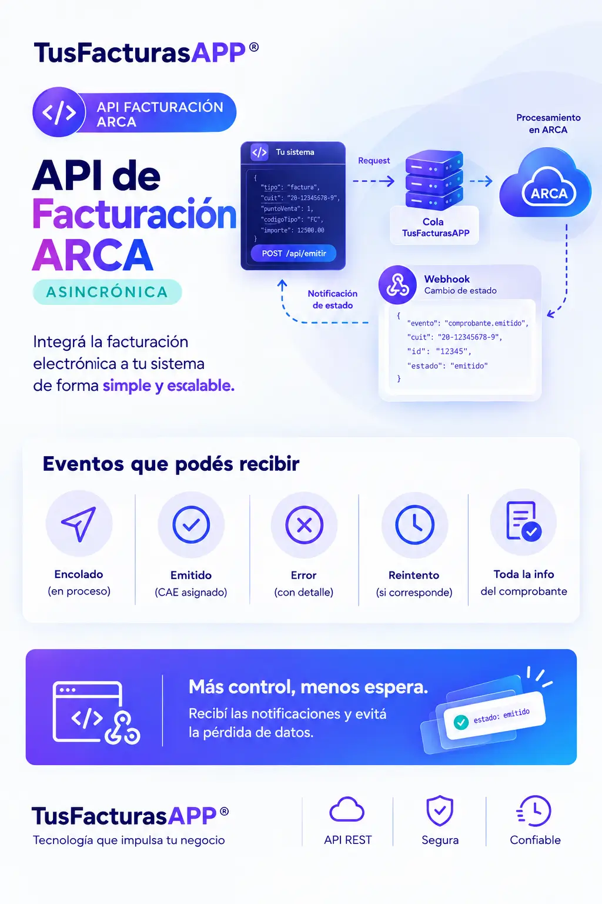
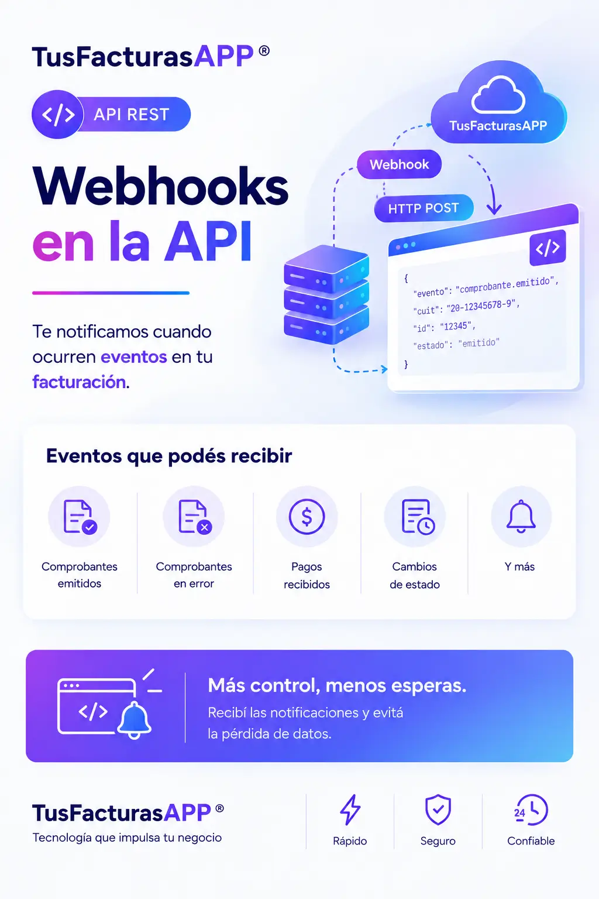

# Facturación asincrónica e  individual

### ⚡ ¿Qué es la API de facturación individual y asincrónica? <a href="#que-es-la-api-de-facturacion-individual-e-instantanea" id="que-es-la-api-de-facturacion-individual-e-instantanea"></a>

La **API de ARCA para facturación electrónica individual y asincrónica de TusFacturas**

**APP** te permite **emitir comprobantes fiscales válidos ante ARCA**. Es ideal para grandes volúmenes de facturación o cuándo el funcionamiento de tu plataforma no dependa del estado en tiempo real  de los servicios de ARCA. Integra fácil la facturación electrónica de AFIP/ARCA a tu sistema, cumpliendo con las normativas fiscales vigentes en Argentina.


### 🛠 ¿Cómo funciona la modalidad Asincrónica de Facturación ARCA/AFIP?



### Envias un request a TusFacturasAPP

Tu plataforma debe enviar el [`request`](referencia-api-afip-arca.md) del comprobante a TusFacturasAPP sin incluir el número de factura. Si es válido, el comprobante se añadirá a una cola de procesamiento.



### Se genera la factura, nota de débito o nota de crédito

Si el comprobante se pudo facturar, generamos el PDF y le enviamos a tu cliente un email para que descargue el comprobante.



### TusFacturasAPP te envia un hook

A medida que se procesan las ventas, TusFacturasAPP te envía [webhooks](webhooks-notificaciones.md) con diferentes eventos:\
\- encolado\
\- emitido\
\- error

Una vez recibido el hook, debes consultar la información del comprobante con una [consulta avanzada por external\_reference](../web-services-afip-api-arca/consulta-avanzada-por-external-reference.md).



<figure><figcaption></figcaption></figure>

***

### **✅ Requisitos previos y consideraciones clave**

Antes de armar tu primer request, tené en cuenta lo siguiente:

* **El campo `external_reference` es obligatorio** y debe ser único en tu sistema. TusFacturasAPP no valida su unicidad: si enviás el mismo valor más de una vez, la plataforma procesará cada solicitud sin realizar esa validación.
* **La fecha del comprobante determina cuándo será enviado a procesar.** Podés enviar comprobantes a la cola con fecha posterior a hoy.
* **El número del comprobante debe enviarse en `0`**, ya que será determinado al momento de emitirse.
* **Tu punto de venta debe tener una URL de webhook configurada.** Podés hacerlo desde la plataforma web: Menú > Mi espacio de trabajo > Puntos de venta.
* **No se permiten comprobantes tipo E** en la modalidad asincrónica.
* **La suscripción de tu espacio de trabajo debe estar vigente, activa y con cupo de facturación disponible** para emitir el comprobante (aunque no se emita hoy).
* Los errores de validación de datos bloquean el envío a la cola y generan una **respuesta inmediata** (no por webhook).

***

### **🚀 Endpoint y parámetros del request**

Consultá nuestra [guía completa **“Referencia API AFIP ARCA”**](https://developers.tusfacturas.app/api-factura-electronica-afip-facturacion-ventas/referencia-api-afip-arca), donde encontrarás especificaciones técnicas, campos requeridos, ejemplos de código listos para usar y buenas prácticas de integración.

**Endpoint:**


<mark style="color:green;">`POST`</mark>&#x20;

`https://www.tusfacturas.app/app/api/v2/facturacion/`<mark style="color:purple;">**`nuevo_encola`**</mark>

💡 Cada vez que utilices este método, se contará como un request en tu suscripción. Los requests se cuentan por cada método que uses.


**Body:**

| Campo       | Tipo   | Descripción                                                                                                                                     |
| ----------- | ------ | ----------------------------------------------------------------------------------------------------------------------------------------------- |
| usertoken   | string | Tus credenciales de acceso                                                                                                                      |
| apitoken    | string | Tus credenciales de acceso                                                                                                                      |
| apikey      | string | Tus credenciales de acceso                                                                                                                      |
| comprobante | object | Estructura de “[comprobante](referencia-api-afip-arca.md#estructura-del-bloque-comprobante)” según se informa en el apartado de facturación     |
| cliente     | object | Estructura de “[cliente](referencia-api-afip-arca.md#estructura-del-bloque-cliente-y-proveedor)” según se informa en el apartado de facturación |

El bloque `comprobante` debe incluir el campo `external_reference`:

```json
{
  "comprobante": {
    "external_reference": "ABC123",
    ...
  }
}
```

***

### **⏱ Tiempos y capacidades de procesamiento**

No existe un tiempo determinado, ya que los tiempos varían según el volumen de ventas programadas, el estado de los servicios de ARCA y el tipo de comprobante a emitir.

**Capacidades de procesamiento diarias aproximadas:**

| Comprobantes tipo A                           | Comprobantes tipo B                           | Otros                                        |
| --------------------------------------------- | --------------------------------------------- | -------------------------------------------- |
| Hasta **100.000** por día, por punto de venta | Hasta **150.000** por día, por punto de venta | Hasta **14.000** por día, por punto de venta |

> Para acelerar la facturación podes distribuir la carga en múltiples puntos de venta. Sin embargo, no podemos garantizar que todo el volumen se emita en un solo día, por lo que recomendamos enviar la facturación con antelación para evitar inconvenientes.

***

Acá va el bloque, listo para insertar (yo lo pondría justo antes de la sección de webhooks, o como sub-sección dentro del hook de `error`):

***

### 🔁 Reintentos en la cola de procesamiento

Cuando un comprobante no puede emitirse, ya sea porque los servicios de ARCA no funcionan o cualquier otro impedimento que exista, TusFacturasAPP **reintenta automáticamente hasta 100 veces** antes de marcarlo con error definitivo. La excepción son los errores irrecuperables (por ejemplo, datos inválidos que ARCA rechazará siempre): en esos casos, el comprobante queda marcado con error de forma inmediata, sin esperar a agotar los reintentos.

**¿Cuándo recibís un webhook de error?**\
Cuando se alcanza el máximo de intentos, o en el momento en que se detecta que el error es irrecuperable, lo que ocurra primero.

**¿Qué hacer si un comprobante superó el límite de reintentos?**\
Depende del tipo de error:

* **Error de datos** (campos inválidos, rechazos de ARCA por información incorrecta): debes eliminar el comprobante de la cola y volver a crearlo con los datos corregidos.
* **Error de enlace con ARCA o de suscripción** (problemas de conectividad, cupo, credenciales): Algunos de los errores mantienen a tu comprobante aun en cola mientras resolves el problema (enlace con ARCA, crear punto de venta, etc). Si tu suscripcion no tiene cupo o no se encuentra vigente, el comprobante no se acepta directamente. &#x20;

> ⚠️ **Regla de reintento secuencial:** todo comprobante rechazado o con error debe reenviarse a reprocesar exactamente en el mismo orden cronológico/secuencial en el que fue emitido originalmente. No respetar este orden puede generar inconsistencias en la numeración de comprobantes ante ARCA.

***

### **📋 Ejemplos de cómo facturar según tipo de comprobante y letra**

Cada ejemplo incluye los campos requeridos y opcionales, además de los valores específicos para cada categoría. Esto te permitirá implementar la facturación electrónica de forma ágil y segura desde cualquier sistema.

> ⚠️ En la modalidad asincrónica no se permiten comprobantes tipo E.


[web-services-afip-api-arca](../web-services-afip-api-arca/)


***

### **📨 Respuestas de la API**

La API devuelve dos tipos de respuestas: **inmediatas** (al momento de hacer el POST) y **asincrónicas** (mediante webhooks, a medida que el comprobante se procesa).

***

#### **Respuestas inmediatas**

Al hacer el POST, recibirás una respuesta instantánea en uno de estos tres casos:

***

🟢 **Aceptado — el request fue encolado correctamente**

Una vez que tu solicitud pase la validación inicial, el sistema responde de forma inmediata confirmando que el comprobante fue aceptado para su procesamiento.

```json
{
  "error": "N",
  "errores": [],
  "error_cod": [],
  "error_details": [],
  "external_reference": "ex_rf1",
  "requiere_fec": "NO",
  "observaciones": "",
  "rta": "El comprobante se ha guardado correctamente",
  "cae": " ",
  "vencimiento_cae": "01\/01\/2000",
  "vencimiento_pago": "21\/03\/2022",
  "comprobante_nro": "00010-00000000",
  "comprobante_tipo": "FACTURA A",
  "afip_codigo_barras": "",
  "afip_qr": "",
  "envio_x_mail": "N",
  "envio_x_mail_direcciones": "",
  "micrositios": {
    "cliente": "",
    "descarga": ""
  },
  "comprobante_pdf_url": ""
}
```

***

🔴 **Error de validación — el request fue rechazado**

Si el request tiene errores de formato, el comprobante será rechazado de forma inmediata. Adicionalmente, si tu punto de venta tiene webhook configurado y el request incluye `external_reference`, también recibirás un webhook de error.

Ejemplo de respuesta inmediata:

```json
{
  "error": "S",
  "errores": [
    "La external reference enviada, posee caracteres no validos.",
    "Error al crear al cliente . No se podra generar el comprobante. Revise los datos enviados."
  ],
  "error_cod": [],
  "error_details": [
    {
      "code": "TFC-8002",
      "text": "La external reference enviada, posee caracteres no validos."
    },
    {
      "code": "TFC-6001",
      "text": "Error al crear al cliente . No se podra generar el comprobante. Revise los datos enviados."
    }
  ],
  "external_reference": "1%'703"
}
```

Ejemplo del webhook que acompaña el error:

```json
{
  "creado": "24\/05\/2022 16:58:51",
  "evento": "error",
  "recurso": "facturacion",
  "external_reference": "1%'703",
  "intento": 1,
  "msg": [
    "La external reference enviada, posee caracteres no validos.",
    "Error al crear al cliente . No se podra generar el comprobante. Revise los datos enviados."
  ],
  "hook_id": "xxxx"
}
```

***

🔴 **Mantenimiento programado**

En ocasiones, nuestro equipo técnico realiza [tareas de mantenimiento](../web-services-afip-api-arca/api-factura-electronica-afip-estado-de-los-servicios-afip.md#mantenimientos-programados) programado que requieren suspender temporalmente la operatoria de la API. Durante ese período, las solicitudes devolverán una respuesta como la siguiente:

json

```json
{
  "error": "S",
  "mantenimiento": 1,
  "mantenimiento_hasta": "26/07/2026 05:25",
  "errores": [
    "Estaremos realizando tareas de mantenimiento hasta las 05:25"
  ]
}
```

***

### **📬 Webhooks (respuestas asincrónicas)**

A medida que los comprobantes se procesan, TusFacturasAPP te envía webhooks con el estado de cada uno. Existen 3 eventos posibles para el recurso de facturación: `encolado`, `emitido` y `error`.

Conocé más sobre los [webhooks](webhooks-notificaciones.md).

***

> 💡 Los webhooks tienen su propio mecanismo de reintentos de entrega, independiente de la cola de procesamiento de comprobantes. Conocé cómo funciona y cómo configurarlo en la [documentación de webhooks](webhooks-notificaciones.md#reintentos).

<figure><figcaption></figcaption></figure>

***

🟣 **Hook: `encolado`**

| recurso     | evento   |
| ----------- | -------- |
| facturacion | encolado |

Te informa que el request fue aceptado y está dentro de la cola de procesamiento. Mientras el comprobante se encuentre encolado, podes: cambiar su fecha o eliminarlo de la cola.

```json
{
  "creado": "18/03/2022 15:58:11",
  "evento": "encolado",
  "recurso": "facturacion",
  "external_reference": "17032",
  "intento": 1,
  "msg": [],
  "hook_id": "xxxxx"
}
```

***

🟢 **Hook: `emitido`**

| recurso     | evento  |
| ----------- | ------- |
| facturacion | emitido |

Te informa que el comprobante fue procesado y emitido con éxito. Una vez recibido este hook, debés realizar una consulta avanzada por `external_reference` para obtener los datos del comprobante.

```json
{
  "creado": "18/03/2022 15:58:11",
  "evento": "emitido",
  "recurso": "facturacion",
  "external_reference": "17032",
  "intento": 1,
  "msg": [],
  "hook_id": "xxx"
}
```

***

🔴 **Hook: `error`**

| recurso     | evento |
| ----------- | ------ |
| facturacion | error  |

Te informa que el comprobante fue procesado pero no pudo emitirse. Podes: cambiar su fecha, reenviarlo a la cola o eliminarlo.

> ⚠️ **Regla de reintento secuencial:** cuando un comprobante devuelve error (por microcortes o latencia en los servicios de ARCA/AFIP), es posible que haya sido procesado correctamente en ARCA a pesar de la falla reportada. Para evitar bloqueos y garantizar la recuperación del CAE, todo comprobante rechazado debe reenviarse a reprocesar exactamente en el mismo orden cronológico/secuencial en el que fue enviado originalmente.


```json
{
  "creado": "18/03/2022 15:58:11",
  "evento": "error",
  "recurso": "facturacion",
  "external_reference": "17032",
  "intento": 1,
  "msg": [
    "AFIP Factura electronica, informa el siguiente error: Cod. Error: #6661145.0 - AFIP rechazo la generacion del comprobante",
    "AFIP Factura electronica, informa el siguiente error: Cod. Error: #6661145.10036 - El campo FchVtoPago no puede ser anterior a la fecha del comprobante.",
    "AFIP No devolvio el CAE asociado. (Cod. Error #6661141.S1254)",
    "AFIP No devolvio el CAE asociado. (Cod. Error #6661141.S1278)"
  ],
  "hook_id": "xxx"
}
```

***

### Preguntas frecuentes


[faqs-or-ventas-asincronicas.md](../faqs-or-ventas-asincronicas.md)



### ¿Aún te quedan dudas? ¡Contactános!

En caso que requieras asistencia o tengas alguna duda relacionada con tu plan API DEV,  envíanos un mensaje a api@tusfacturas.app o [contactanos](https://www.tusfacturas.app/contacto.html) por el chat que tenemos disponible en la web [www.tusfacturas.app](https://www.tusfacturas.app/quiero-probar-api-factura-electronica.html).

***

TusFacturasAPP es una solución SaaS líder en facturación electrónica en Argentina, diseñada para facilitar a empresas y desarrolladores la integración directa con los webservices de facturación de ARCA (ex AFIP) mediante una API robusta, segura y fácil de implementar.
