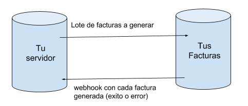

# Facturación asincrónica por Lotes (encolada)

TusFacturasAPP es un proveedor SaaS líder de servicios de facturación electrónica en Argentina, que permite a empresas de todos los tamaños emitir comprobantes fiscales válidos de manera rápida, segura y cumpliendo con todas las regulaciones de la AFIP.

Integra fácilmente la facturación electrónica en tu software con la API de TusFacturasAPP. Emite comprobantes fiscales válidos desde tu sistema y obtén respuestas inmediatas de la AFIP.

Una vez configurada tu cuenta y creados tus CUIT/Puntos de Venta, podrás comenzar a facturar electrónicamente sin demoras. Revisa nuestras guías "[Cómo empiezo](../como-empiezo.md)" y  "[API Facturación AFIP](./)" para conocer a fondo el servicio y los requerimientos de cada solicitud.

Comenza ya a cumplir con las regulaciones fiscales y brinda una experiencia de facturación digital eficiente a tus clientes. [Solicita acceso](https://www.tusfacturas.app/quiero-probar-api-factura-electronica.html) a nuestra API de facturación electrónica.

### ¿Cómo funciona el modo asincrónico de facturación API por lote?



### ¿Qué puedo facturar con la API por lote asincrónica?

Podes enviar a facturar comprobantes de tipo A,B,C, M y comprobantes de tipo Factura de crédito electrónica MiPyme; ya sean facturas, notas de crédito, notas de débito y hasta facturas-recibos, pero **no podrás enviar comprobantes de tipo E  en ésta modalidad.**

&#x20;¿No sabes qué [tipo de comprobante debes emitir](../que-tipos-de-comprobante-debo-puedo-emitir.md)? Consultalo [desde aquí](../que-tipos-de-comprobante-debo-puedo-emitir.md)

Tenés alguna duda del servicio? chequea las [API FAQs](../faqs-or-preguntas-frecuentes.md), y si no encontrás lo que buscabas, contáctanos por los canales de atención que tenemos disponibles en la plataforma web [www.tusfacturas.app](https://www.tusfacturas.app)

### **Facturación asincrónica por Lote**

Al utilizar éste servicio los comprobantes que envíes quedarán en una cola de procesamiento. A medida que se van procesando, se te enviará un [webhook](../webhooks-notificaciones.md) para que puedas obtener la información generada. &#x20;

#### Antes de comenzar, te sugerimos leer :&#x20;

1. La documentación de "[Facturación](./)", para conocer cómo debe componerse el request que envíes
2. La documentación "[Webhooks (notificaciones)](../webhooks-notificaciones.md)" para conocer cómo funciona el servicio de notificaciones.
3. [FAQs sobre la cola de procesamiento](../faqs-or-cola-de-procesamiento.md)


### Sugerencias para grandes volúmenes de facturación


* Distribuí tu facturación en múltiples puntos de venta, de modo que cada uno se procese en paralelo y así optimizarás la emisión de las facturas.
* Cantidad estimada de comprobantes que se emiten por hora, dependiendo del día y horario: entre 600 y 900 por hora y punto de venta.



### ¿A dónde debes enviar el request?

<mark style="color:green;">`POST`</mark> `https://www.tusfacturas.app/app/api/v2/facturacion/lotes_encola`


Máximo: 100 comprobantes por lote.


Charset: UTF-8

Formato esperado: JSON

#### Request Body

| Name      | Type   | Description                                                                                  |
| --------- | ------ | -------------------------------------------------------------------------------------------- |
| requests  | array  | Lista de comprobantes a enviar , segun estructura se detalla en  [API Facturacion AFIP](./). |
| usertoken | string | Tus credenciales de acceso                                                                   |
| apitoken  | string | Tus credenciales de acceso                                                                   |
| apikey    | string | Tus credenciales de acceso                                                                   |

### Estructura del bloque: "requests"

"requests" debe ser un array (en JSON) que contiene cada uno de los comprobantes a emitir, según se define en la documentación de "[Facturación](./)".


### Datos a tener en cuenta:

* **La cantidad máxima de requests por lote es de 100 comprobantes**, pero debes tener en cuenta que por cuestiones de seguridad, nuestra plataforma funciona limitando su tiempo de procesamiento y  podes llegar a obtener una respuesta de timeout (524). En caso de recibir un 524, los requests que enviaste, seguirán siendo procesados en background, y recibirás un hook con la respuesta de éxito o error de su encolamiento. &#x20;
* Podes enviar en un mismo lote comprobantes de **diferente tipo de comprobante**.   Ej: Podes enviar en el mismo lote Facturas A Y FACTURAS  B.
* **La fecha que envíes en cada comprobante determina cuándo será enviado a procesar**, por lo que puedes enviar comprobantes a la cola de procesamiento con fecha posterior a hoy. &#x20;
* Los request deben venir **con el campo número en cero (0)**.
* **Debes enviar un "external\_reference" de manera obligatoria y debería ser único**. TusFacturasAPP no realiza ésta validación, por lo que si envias +1 request con el mismo external\_reference, tendrás problemas de tu lado para procesar las respuestas.
* **Tu CUIT + PDV, debe tener una** [**dirección de webhook**](../mi-cuenta/agregar-o-modificar-puntos-de-venta-pdv.md) definida, de manera obligatoria, ya que sin ella, no se podrán enviar a procesar los lotes y serán rechazados de manera instantánea.
* **No podrás enviar comprobantes de** [**tipo E**](api-factura-electronica-afip-factura-electronica-afip-exportacion.md)  **en ésta modalidad.**
* **Al momento del envío del lote, la suscripción de tu espacio de trabajo debe encontrarse  vigente, activa y con cupo disponible** para emitir la cantidad de comprobante que estás enviando en el lote.
* Si se detecta al menos un (1) error de validación de datos, el lote se procesará parcialmente. De aquellos comprobantes con error obtendrás la respuesta al instante, no por un webhook.




La estructura de cada "{objeto\_comprobante}" debe ser acorde a los siguientes tipos de comprobante a generar:&#x20;

[comprobantes de tipo A](api-factura-electronica-afip-factura-a-nota-de-debito-a-nota-de-credito-a.md)

&#x20;[comprobantes de tipo B](api-factura-electronica-afip-factura-nota-de-debito-b-nota-de-credito-bb.md)

[comprobantes de tipo C](api-factura-electronica-afip-factura-c-nota-de-debito-c-nota-de-credito-c.md)[ ](api-factura-electronica-afip-factura-electronica-afip-exportacion.md)

&#x20;[Comprobantes de tipo Factura de crédito electrónica MiPyme](api-factura-electronica-afip-factura-de-credito-electronica-mipyme-fce.md)

Revisa nuestra guía  "[API Facturación AFIP](./)" para conocer a fondo el servicio y los requerimientos de cada solicitud.

#### Ejemplo de JSON a enviar


```json
{
	"apitoken": "xxxx",
	"apikey": "xxxx",
	"usertoken": "xxxxx",
	"requests": [
			{objeto_comprobante}, 
			{objeto_comprobante}, 
			{objeto_comprobante}
		    ]
}
```


### **¿Que te retornaremos ?**

#### :red\_circle: ERROR: Error de validación de los datos enviados en el lote:

Si enviasjsonsons un lote que no cumple con los requisitos básicos, detallados a continuación:&#x20;

* La cantidad de requests supera el máximo permitido.
* No has enviado ningún request a procesar en el bloque de "requests"
* Tu CUIT+PDV no posee una dirección de webhook válida

Ten en cuenta que el lote no se procesará, obtendrás la respuesta al instante y no se te notificará vía webhook.

Ejemplo de una llamada con 300 requests, que superan el máximo establecido:


```json
{
	"error": "S",
	"errores": [
		"Esta enviando 300 requests, cuando el limite permitido es 100. El lote no se procesara.",
		"El lote no se procesara ya que contiene errores en todos sus requests. Se enviaron a procesar: 3 requests y se aceptaron procesar: 0. "
	],
	"error_cod": [],
	"error_details": [],
	"response": []
}
```


En cambio, si existen errores en algunos requests, el lote se procesará parcialmente y se te irá notificando vía webhook de su procesamiento.

Ej: un lote con 3 requests, donde el primero no tiene una external\_reference definida, puede arrojarte una respuesta al instante, de éste estilo:

```json
{
	"error": "S",
	"errores": [
		"El lote se procesara parcialmente ya que contiene errores en alguno de sus requests. Se enviaron a procesar: 3 requests y se aceptaron procesar: 2. "
	],
	"error_cod": [],
	"error_details": [],
	"response": [
		{
			"error": "N",
			"errores": [],
			"cae": " ",
			"cae_vencimiento": null,
			"observaciones": "",
			"envio_x_mail": "N",
			"envio_x_mail_direcciones": "",
			"tfc_generacion_tipo": 3,
			"external_reference": "M170_502",
			"rta": "El comprobante  se ha guardado correctamente ",
			"vencimiento_cae": "01\/01\/2000",
			"vencimiento_pago": "13\/05\/2022",
			"comprobante_nro": "00010-00000000",
			"comprobante_tipo": "FACTURA B",
			"afip_codigo_barras": "",
			"afip_qr": "",
			"comprobante_pdf_url": ""
		},
		{
			"error": "N",
			"errores": [],
			"cae": " ",
			"cae_vencimiento": null,
			"observaciones": "",
			"envio_x_mail": "N",
			"envio_x_mail_direcciones": "",
			"tfc_generacion_tipo": 3,
			"external_reference": "M170503",
			"rta": "El comprobante  se ha guardado correctamente ",
			"vencimiento_cae": "01\/01\/2000",
			"vencimiento_pago": "11\/04\/2022",
			"comprobante_nro": "00010-00000000",
			"comprobante_tipo": "FACTURA A",
			"micrositios": {
				"cliente": "url-del-micrositio",
				"descarga":"url-del-micrositio"
		     	},
			"afip_codigo_barras": "",
			"afip_qr": "",
			"comprobante_pdf_url": ""
		},
		{
			"error": "S",
			"errores": [
				"El request enviado en el orden 0 (comenzando en 0) incluye un comprobante con un external_reference no valido.  Este request no se procesara."
			],
			"external_reference": "% 'M17051",
			"rta": "Eror. No se procesara"
		}
	]
}
```

y a su vez, enviarte los siguientes webhooks:

```json
{
	"creado": "24\/05\/2022 16:46:39",
	"evento": "encolado",
	"recurso": "facturacion",
	"external_reference": "M170_502",
	"intento": 1,
	"msg": [],
	"hook_id": "xxxx"
}
```

```
{
	"creado": "24\/05\/2022 16:46:39",
	"evento": "error",
	"recurso": "facturacion",
	"external_reference": "% 'M17051",
	"intento": 1,
	"msg": ["El request enviado en el orden 0 (comenzando en 0) incluye un comprobante con un external_reference no valido.  Este request no se procesara."],
	"hook_id": "xxxx"
}
```

```json
{
	"creado": "24\/05\/2022 16:46:39",
	"evento": "encolado",
	"recurso": "facturacion",
	"external_reference": "M170503",
	"intento": 1,
	"msg": [],
	"hook_id": "xxxx"
}
```

```json
{
	"creado": "24\/05\/2022 16:47:06",
	"evento": "error",
	"recurso": "facturacion",
	"external_reference": "M170503",
	"intento": 1,
	"msg": [" AFIP Factura electronica, informa el siguiente error: Cod. Error: #6661145.10016 - El numero o fecha del comprobante no se corresponde con el proximo a autorizar. Consultar metodo FECompUltimoAutorizado. Si necesitas ayuda, contactanos", " AFIP Factura electronica, informa el siguiente error: Cod. Error: #6661145.0 - AFIP rechazo la generacion del comprobante Si necesitas ayuda, contactanos ", "AFIP No devolvio el CAE asociado. (Cod. Error #6661141.S1254)", "AFIP No devolvio el CAE asociado. (Cod. Error #6661141.S1278)"],
	"hook_id": "xxxx"
}
```

```json
{
	"creado": "24\/05\/2022 16:47:10",
	"evento": "error",
	"recurso": "facturacion",
	"external_reference": "M170_502",
	"intento": 1,
	"msg": [" AFIP Factura electronica, informa el siguiente error: Cod. Error: #6661145.10016 - El numero o fecha del comprobante no se corresponde con el proximo a autorizar. Consultar metodo FECompUltimoAutorizado. Si necesitas ayuda, contactanos", " AFIP Factura electronica, informa el siguiente error: Cod. Error: #6661145.0 - AFIP rechazo la generacion del comprobante Si necesitas ayuda, contactanos", "AFIP No devolvio el CAE asociado. (Cod. Error #6661141.S1254)", "AFIP No devolvio el CAE asociado. (Cod. Error #6661141.S1278)"],
	"hook_id": "xxxx"
}
```


#### :green\_circle: ACEPTADO: Cuando el lote se ha aceptado para su procesamiento:

En caso que no se detecten errores tempranos en la etapa de validación de los datos enviados en el lote, obtendrás la respuesta a cada request enviado, en su mismo orden y luego de enviarte ésta información, recibirás un [webhook](../webhooks-notificaciones.md) por cada request enviado, para informarte que se ha encolado, como se explica a continuación.

Ejemplo de un lote enviado con 3 requests:

```json
{
	"error": "N",
	"errores": [],
	"response": [
		{
			"error": "N",
			"errores": [],
			"cae": " ",
			"cae_vencimiento": null,
			"observaciones": "",
			"envio_x_mail": "N",
			"envio_x_mail_direcciones": "",
			"tfc_generacion_tipo": 3,
			"external_reference": 17032,
			"rta": "El comprobante  se ha guardado correctamente ",
			"vencimiento_cae": "01\/01\/2000",
			"vencimiento_pago": "16\/03\/2022",
			"comprobante_nro": "00010-00000000",
			"comprobante_tipo": "FACTURA A",
			"afip_codigo_barras": "",
			"micrositios": {
				"cliente": "url-del-micrositio",
				"descarga":"url-del-micrositio"
		     	},
			"afip_qr": "",
			"comprobante_pdf_url": ""
		},
		{
			"error": "N",
			"errores": [],
			"cae": " ",
			"cae_vencimiento": null,
			"observaciones": "",
			"envio_x_mail": "N",
			"envio_x_mail_direcciones": "",
			"tfc_generacion_tipo": 3,
			"external_reference": "1453_01",
			"rta": "El comprobante  se ha guardado correctamente ",
			"vencimiento_cae": "01\/01\/2000",
			"vencimiento_pago": "18\/03\/2022",
			"comprobante_nro": "00010-00000000",
			"comprobante_tipo": "FACTURA B",
			"micrositios": {
				"cliente": "url-del-micrositio",
				"descarga":"url-del-micrositio"
		     	},
			"afip_codigo_barras": "",
			"afip_qr": "",
			"comprobante_pdf_url": ""
		},
		{
			"error": "N",
			"errores": [],
			"cae": " ",
			"cae_vencimiento": null,
			"observaciones": "",
			"envio_x_mail": "N",
			"envio_x_mail_direcciones": "",
			"tfc_generacion_tipo": 3,
			"external_reference": "1453_02",
			"rta": "El comprobante  se ha guardado correctamente ",
			"vencimiento_cae": "01\/01\/2000",
			"vencimiento_pago": "18\/03\/2022",
			"comprobante_nro": "00010-00000000",
			"comprobante_tipo": "FACTURA A",
			"micrositios": {
				"cliente": "url-del-micrositio",
				"descarga":"url-del-micrositio"
		     	},
			"afip_codigo_barras": "",
			"afip_qr": "",
			"comprobante_pdf_url": ""
		}
	]
}
```


## Webhooks de respuesta&#x20;

Existen 3 tipos de evento posible, para el recurso de facturación que podes recibir en ésta instancia:  "encolado", "emitido" y "error". Te sugerimos conocer más sobre los webhooks, en la documentación de [Webhooks (notificaciones)](../webhooks-notificaciones.md).

### :purple\_circle: Hook de "encolado"  &#x20;

|   recurso   |  evento  |
| :---------: | :------: |
| facturacion | encolado |

El hook de "encolado", te informa que el request ha sido aceptado para su procesamiento. Mientras un comprobante se encuentre dentro de la cola de procesamiento, puedes realizar las siguientes operaciones:  [Cambiar fecha del comprobante](cambiar-fecha-a-comprobante-encolado.md) o [eliminar el comprobante de la cola de procesamiento](eliminar-comprobantes-encolados.md).

&#x20;El JSON que recibirás será similar al siguiente ejemplo:

```json
{
	"creado": "18/03/2022 15:58:11",
	"evento": "encolado",
	"recurso": "facturacion",
	"external_reference": "17032",
	"intento": 1,
	"msg": [],
	"hook_id": "xxxxx"
}
```

### &#x20;:green\_circle: Hook de "emitido"&#x20;

|   recurso   |  evento |
| :---------: | :-----: |
| facturacion | emitido |

El hook de "emido", te informa que el request ha sido procesado con éxito y se ha emitido el comprobante correctamente.  Una vez recibido éste hook, podrás realizar una [consulta avanzada por external\_reference](consulta-avanzada-de-comprobantes-enviados.md#como-realizar-una-consulta-avanzada-por-external-reference),  para obtener los datos generados de éste comprobante.&#x20;

El JSON que recibirás será similar al siguiente ejemplo:&#x20;

```json
{
	"creado": "18/03/2022 15:58:11",
	"evento": "emitido",
	"recurso": "facturacion",
	"external_reference": "17032",
	"intento": 1,
	"msg": [],
	"hook_id": "xxx"
} 
```

### :red\_circle: Hook de "error"&#x20;

|   recurso   | evento |
| :---------: | :----: |
| facturacion |  error |

El hook de "error", te informa que el request ha sido procesado, pero se han detectado errores y no se podrá facturar. Si un comprobante se encuentra procesado con error dentro de la cola de procesamiento, puedes realizar las siguientes operaciones:  [Cambiar fecha del comprobante,](cambiar-fecha-a-comprobante-encolado.md) [re-enviar el comprobante a la cola de procesamiento](reenviar-a-procesar-comprobante-encolado-con-error.md) o [eliminar el comprobante de la cola de procesamiento](eliminar-comprobantes-encolados.md).

El JSON que recibirás será similar al siguiente ejemplo y a diferencia de los anteriores, obtendrás la lista de errores detectados, dentro del campo "msg".

```json
{
	"creado": "18/03/2022 15:58:11",
	"evento": "error",
	"recurso": "facturacion",
	"external_reference": "17032",
	"intento": 1,
	"msg": [
		" AFIP Factura electronica, informa el siguiente error: Cod. Error: #6661145.0 - AFIP rechazo la generacion del comprobante Si necesitas ayuda, contactanos en hola@tusfacturas.app", 
		" AFIP Factura electronica, informa el siguiente error: Cod. Error: #6661145.10036 - El campo FchVtoPago no puede ser anterior a la fecha del comprobante. Si necesitas ayuda, contactanos en hola@tusfacturas.app", 
		"AFIP No devolvio el CAE asociado. (Cod. Error #6661141.S1254)", 
		"AFIP No devolvio el CAE asociado. (Cod. Error #6661141.S1278)"
	],
	"hook_id": "xxx"
}  
```

&#x20;

