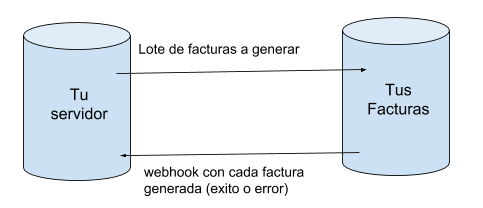

# Webhooks (notificaciones)



## ¿Qué es un WebHook?

Un `webhook` es una notificación que se envía de un servidor a otro, mediante una llamada `HTTP POST` al ocurrir un determinado evento.

TusFacturasAPP te enviará un webhook, siempre que se produzca uno o más eventos registrados en la modalidad de facturación asincrónica encolada,  evitando pérdida de datos siempre que se presente alguna situación.

## Dirección del webhook

La dirección del webhook, se configura dentro de tu CUIT+PDV. Para eso deberás ingresar al MENÚ > Mi espacio de trabajo > Cuits + PDV y editando el registro de tu CUIT, podrás agregarlo.&#x20;

La dirección que establezcas para el webhook, no debe contener un redirect y debe encontrarse funcionando. Si la misma se encuentra fuera de servicio por más de 24hs será ignorada por completo y no se te notificará nada más, hasta que indiques una nueva URL.

El formato esperado es: _https://www.dominio.com/script-nombre_

## **¿Qué te notificaremos vía  webhook?**

Vas a recibir por **POST** un JSON, con la siguiente estructura, para que puedas relacionar mediante el _external\_reference_ que nos enviaste, al comprobante en cuestión, por tal motivo el _external\_reference_ que envíes, debe ser único.


```
{
	"creado": "18/03/2022 15:58:11",
	"evento": "encolado",
	"recurso": "facturacion",
	"external_reference": "17032",
	"intento": 1,
	"msg": [],
	"hook_id": "xxxxx"
} 
```


En los headers del request que te enviamos, podrás observar la/s siguiente/s cabeceras:

User-Agent: TusFacturasAPP-webhook/1.0


### Tipos de evento posibles, por recurso

<table><thead><tr><th align="center">recurso</th><th width="154.8318397469689" align="center">evento</th><th>info</th></tr></thead><tbody><tr><td align="center">facturacion</td><td align="center">encolado</td><td>Éste evento te informa, que el comprobante que enviaste, se encuentra ya en la cola de procesamiento, para ser emitido en la fecha que indicaste.</td></tr><tr><td align="center">facturacion</td><td align="center">emitido</td><td>Éste evento te informa que el comprobante que enviaste, se ha facturado correctamente.</td></tr><tr><td align="center">facturacion</td><td align="center">error</td><td>Éste evento te informa que el comprobante que enviaste, no se ha podido procesar y recibrás dentro del atributo "msg", la lista con los errores detectados</td></tr><tr><td align="center">facturacion</td><td align="center">eliminado</td><td>Éste evento te informa que se ha eliminado un comprobante.</td></tr><tr><td align="center">facturacion</td><td align="center">cambio_fecha</td><td>Éste evento te informa que se ha cambiado la fecha del comprobante.</td></tr><tr><td align="center">test</td><td align="center">test</td><td>Se utilizará éste evento para probar la url de tu webhook</td></tr><tr><td align="center"></td><td align="center"></td><td></td></tr></tbody></table>

## Reintentos

Cuando recibís una notificación en tu plataforma, TusFacturasAPP espera una respuesta para validar que la recibiste correctamente. Para eso, debes devolver un `HTTP STATUS 200 (OK)`. Si no se envía esta respuesta, se entenderá que no ha recibido la notificación y se realizará un nuevo intento de envío hasta que reciba la respuesta.

|      Evento     | Plazo después del último envío | Tiempo de espera de tu confirmación |
| :-------------: | ------------------------------ | ----------------------------------- |
|      Envío      | -                              | 20 segundos                         |
|  Primer intento | 5 minutos                      | 5 segundos                          |
| Segundo intento | 30 minutos                     | 5 segundos                          |
|  Tercer intento | 3 horas                        | 5 segundos                          |
|  Cuarto intento | 6 horas                        | 5 segundos                          |
|  Quinto intento | 12 horas                       | 5 segundos                          |

#### Ejemplo de reintentos

Hook 0 \_\_\_\_\_\_\_\_\_\_\_\_\_ enviado el 22/03/2022 a las 10:00

Hook 1 \_\_\_\_\_\_\_\_\_\_\_\_\_ será enviado el 22/03/2022 a las 10:05

Hook 2 \_\_\_\_\_\_\_\_\_\_\_\_\_ será enviado el 22/03/2022 a las 10:35

Hook 3 \_\_\_\_\_\_\_\_\_\_\_\_\_ será enviado el 22/03/2022 a las 13:35

Hook 4 \_\_\_\_\_\_\_\_\_\_\_\_\_ será enviado el 22/03/2022 a las 19:35

Hook 5 \_\_\_\_\_\_\_\_\_\_\_\_\_ será enviado el 23/03/2022 a las 07:35


## &#x20;Una vez que recibo el webhook, ¿Qué hago?

Una vez recibido el webhook, deberás  realizar las consultas respectivas para obtener los datos generados.

&#x20;A continuación te mostramos, la documentación asociada al recurso del que recibís el webhook.


|   Recurso   |                                                                                              Documentación                                                                                             |
| :---------: | :----------------------------------------------------------------------------------------------------------------------------------------------------------------------------------------------------: |
| facturacion |  [consulta avanzada por external\_reference](api-factura-electronica-afip-facturacion-ventas/consulta-avanzada-de-comprobantes-enviados.md#como-realizar-una-consulta-avanzada-por-external-reference) |
|             |                                                                                                                                                                                                        |
|             |                                                                                                                                                                                                        |


## FAQs&#x20;

#### ¿Dónde configuro mi webhook?

La dirección del webhook, se configura dentro de tu CUIT+PDV. Para eso deberás ingresar al MENÚ > Mi espacio de trabajo > Cuits + PDV y editando el registro de tu CUIT, podrás agregarlo. Tené en cuenta que la dirección del hook, debe ser válida.

#### En caso de que la dirección de mi webhook, presente inconvenientes y falle el webhook, ¿se realizan reintentos hasta completar la notificación?

Si. Te sugerimos consultar el apartado de "[reintentos](webhooks-notificaciones.md#reintentos)", de ésta misma página.


**Si envío un lote de comprobantes, ¿Cómo recibo los hooks?**

Siempre vas a recibir los hooks independientes por cada comprobante.

####

####
